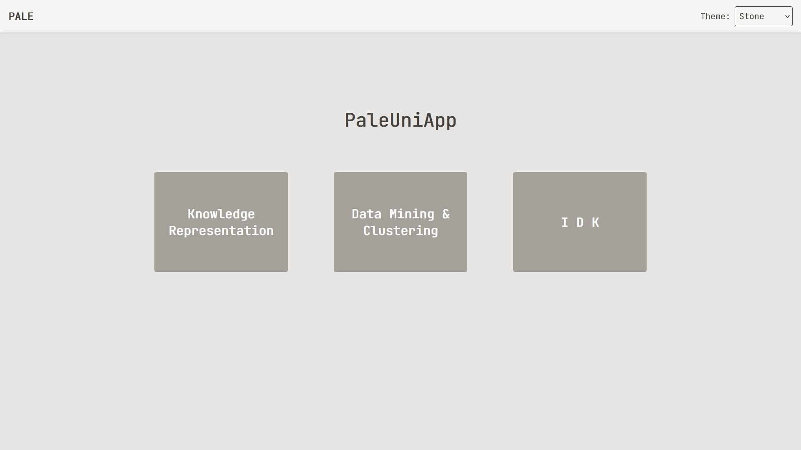
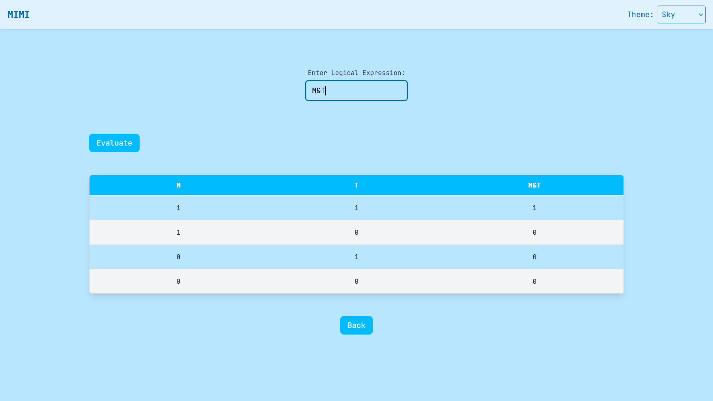
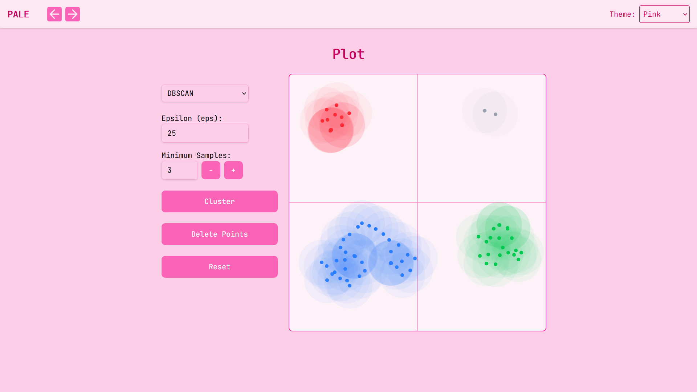
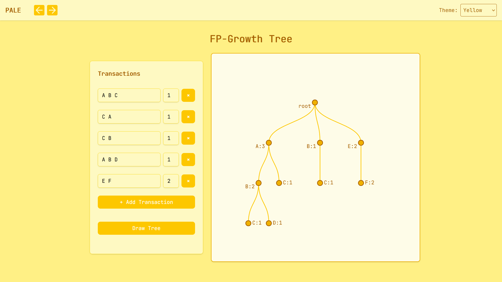

# 🌌 PaleUniApp - AI Algorithm Visualization Platform



A stunning visual playground for exploring AI algorithms through interactive visualizations. PaleUniApp transforms complex AI concepts into beautiful, intuitive experiences.

## ✨ Features

- � **Interactive Truth Tables** - Visualize logical operations
- 🌠 **Cluster Visualizations** - Watch algorithms group data in real-time
- 🌀 **Neural Network Animations** - See how information flows through layers
- � **Algorithm Playground** - Experiment with different parameters

## 🖼️ Gallery

| Truth Table Visualizer         | 
| ------------------------------ | 
|  | 

| Cluster Visualization           |
| ------------------------------- |
| |

| FP Growth Visualizer           |
| ------------------------------- |
| |

| Linear Regression Visualizer             |
|------------------------------------------|
|  |

## 🚀 Quick Start

1. Clone the repository:

   ```bash
   git clone https://github.com/PaleEXE/pale-uni-app.git
   ```

2. Install dependencies:

   ```bash
   npm install
   ```

3. Start the development server:
   ```bash
   uvicorn main:app --reload
   ```
